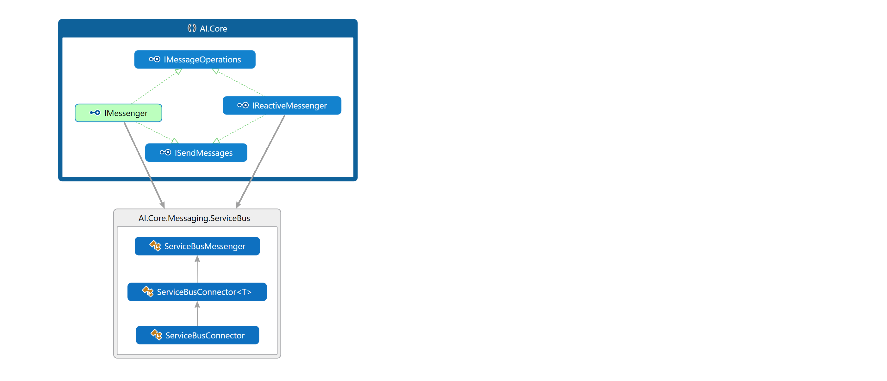

# **Cloud.Core.Messaging.ServiceBus**

<div id="description">

A lightweight adapter for Azure Service Bus (Queues and Topics), that abstracts consuming applications from the Service Bus technology stack by 
implementing common messaging interfaces.

</div>

## Design

One of the patterns used within this package (specifically when receiving messages) is the observable pattern.  This is possible because messages are "pumped" out from the receiver
as an observable collection.  You can read more on the observable pattern here: https://docs.microsoft.com/en-us/dotnet/standard/events/observer-design-pattern

## Usage

### Interface with Core
The *Cloud.Core* package contains these public interfaces for messaging (chain shown below):

<div style="padding-left:40px">


</div>

The main focus of this package being separate from all the other Azure specific packages is to allow for a layer of abstraction in the calling applications.
The abstraction is shown below:


If in the future the calling application was to be run in AWS or Google Cloud, the only thing that would need to be changed in code is the 
instantiation of IMessage.  Using this package, it would look like this:

```csharp
IReactiveMessenger msn = new ServiceBusMessenger(new DevOps.Azure.ServiceBusConfig());
```

Whereas the instantiation could easily be changed to use Google as follows:

```csharp
IReactiveMessenger msn = new PubSubMessenger(new DevOps.GCloud.CloudPubSubConfig());
```


### IMessenger interface 

If you just want to only send messages, you would consume `ISendMessages`.

If you want to send and receive with a simple call back interface use the `IMessenger`.

If instead you want a reactive IObservable that you can subscribe to, use the `IReactiveMessenger`.

You can call `Abandon`, `Complete` and `Error` on the `IMessage` interface.

- All messages arrive with a perpetual Lock applied in the form of a renewal timer on the message.

- `Abandon` will abandon the message, returning it to the original queue.

- `Complete` will actually perform the "Read" on the message taking it from the queue.

- `Error` will move the message to the error queue (dead letter queue), used during critical processing errors where there may be problems with 
validation, business rules, incorrect data, etc.

The interface has been implemented within this package as follows:



### Why wrap the ServiceBus API?


The main application of the IMessenger interfaces is to allow calling applications to switch between their instance adapters without changing code.  The following code demonstates this:

```csharp
IReactiveMessenger msgQueue = new ServiceBusMessenger()
```

Can easily be changed (when developed) to:

```csharp
IReactiveMessenger msgQueue = new RabbitMQMessenger()
```


### Send and receive messages

The messenger implementation allows for generic [POCOs](https://en.wikipedia.org/wiki/Plain_Old_CLR_Object) class types to be used to define the type of messages being sent and received.  Using a generic allows the object types, already used within the calling app, to be reused as message contents.

Here's an example of a simple class that we'll send:

```csharp
public class TestMessage : IMessage
{
    public string Name { get; set; }
    public string Stuff { get; set; }
}
```
### Security and Configuration
There are three ways you can instantiate the Blob Storage Client.  Each way dictates the security mechanism the client uses to connect.  The three mechanisms are:

1. Connection String
2. Service Principle
3. Managed Service Identity


Below are examples of instantiating each type.

### 1. Connection String
Create an instance of the Service Bus client with ConnectionConfig for connection string as follows:

```csharp
var config = new ConnectionConfig
    {
        ConnectionString = "<connectionstring>"
		
		// All other required config set here
    };

// Service Bus client.
var messenger = new ServiceBusMessenger(config);	
```
Note: Instance name not required to be specified anywhere in configuration here as it is taken from the connection string.

### 2. Service Principle
Create an instance of the Blob Storage client with BlobStorageConfig for Service Principle as follows:

```csharp
var config = new ServicePrincipleConfig
    {
        AppId = "<appid>",
        AppSecret = "<appsecret>",
        TenantId = "<tenantid>",
        StorageInstanceName = "<storageinstancename>",
        SubscriptionId = subscriptionId
		
		// All other required config set here
    };

// Service Bus client.
var messenger = new ServiceBusMessenger(config);	
```

Usually the AppId, AppSecret (both of which are setup when creating a new service principle within Azure) and TenantId are specified in 
Configuration (environment variables/AppSetting.json file/key value pair files [for Kubernetes secret store] or command line arguments).

SubscriptionId can be accessed through the secret store (this should not be stored in configuration).

### 3. Management Service Idenity (MSI)
Create an instance of the Blob Storage client with MSI authentication as follows:

```csharp
var config = new MsiConfig
    {
        TenantId = "<tenantid>",
        StorageInstanceName = "<storageinstancename>",
        SubscriptionId = subscriptionId
		
		// All other required config set here
    };

// Service Bus client.
var messenger = new ServiceBusMessenger(config);		
```

All that's required is the instance name to connect to.  Authentication runs under the context the application is running.

### Configuring the client
The above shows the security specific configuration, there are other configurations needed.  Below is an example using Msi auth:

```csharp
var config = new ConfigurationBuilder().AddJsonFile("appSettings.json").Build();
var msiConfig = new MsiConfig
    {
        TenantId = config.GetValue<string>("tenantid"),
        StorageInstanceName = config.GetValue<string>("storageinstancename"),
        SubscriptionId = config.GetValue<string>("subscriptionId")
		
		// All other required config set here
		InstanceName = config.GetValue<string>("InstanceName"),
		SharedAccessPolicy = config.GetValue<string>("SharedAccessPolicy"),
		ReceiverSubscriptionName = config.GetValue<string>("ReceiverSubscriptionName"),
		ReceiverEntity = config.GetValue<string>("ReceiverEntity"),
		SenderEntity = config.GetValue<string>("SenderEntity"),
		MessageVersion = config.GetValue<double>("MessageVersion"),
		IsTopic = config.GetValue<bool>("IsTopic"),
		IsServiceLevelSharedAccessPolicy = true
    };

// Service Bus client.
var messenger = new ServiceBusMessenger(msiConfig);		
```

### How to send a message

The simplest way to do it is by consuming IMessenger and calling `Send` for a single message and `SendBatch` to send a batch of messages (the package handles sending the list of items in batches for you):
```csharp
IMessenger msn = new ServiceBusMessenger(configuration);

msn.Send(new TestMessage{ Name = "Some Name", Stuff = "Some Stuff"  });

msn.SendBatch(new List<TestMessage> {  
  new TestMessage{ Name = "Some Name 1", Stuff = "Some Stuff 1"  },
  new TestMessage{ Name = "Some Name 2", Stuff = "Some Stuff 2"  },
  new TestMessage{ Name = "Some Name 3", Stuff = "Some Stuff 2"  }
});
```
If you set `.ConfigureAwait(false)` the code will continue in a synchronous manner, without awaitng for the task to complete.

### How to receive messages using observables
You can subscribe to new messages using the observable provided by the IReactiveMessenger interface.

```csharp
IReactiveMessenger msn = new ServiceBusMessenger(config);
            
msn.StartReceive<TestMessage>().Subscribe(
  async receivedMsg => {
  
	  // Write processing code here...

      // after processing, complete the message.
	  await msn.Complete(receivedMsg);
  },
  failedEx => {  
      // an exception has occurred.
  });
```

### How to receive messages using callbacks
You can pass callback's into the Receive method as provided IMessenger interface.

```csharp
IMessenger msn = new ServiceBusMessenger(config);
            
msn.Receive<TestMessage>(
  async receivedMsg => {
      // Write processing code here...

      // after processing, complete the message.
      await msn.Complete(receivedMsg);
  },
  failedEx => {  
      // an exception has occurred.
  });
```

## *NOTE* Ones to watch out for...
### Body Type
There are three body types supported when sending messages - Stream, String and WCF.  By default ALL messages are sent and (expected to be) received 
with body type *Stream".  Content as a stream is more performant, so by default String support *IS NOT* enabled.  To enable this, when instantiating
the AzureServiceBus client and passing in the configuration, make sure to set the *EnableStringBodyTypeSupport* property to _true_.

This property has been retrospectively added for backwards support with existing Topics and messages.

### Topic Setup - Don't enable partitioning
All of  topic's are premium and should have "EnablePartitioning" set to false.  This can only be set when the topic is being created
so make sure that is the case when the infrastructure deployment scripts are being setup.


## Test Coverage
A threshold will be added to this package to ensure the test coverage is above 80% for branches, functions and lines.  If it's not above the required threshold 
(threshold that will be implemented on ALL of the new core repositories going forward), then the build will fail.

## Compatibility
This package has has been written in .net Standard and can be therefore be referenced from a .net Core or .net Framework application. The advantage of utilising from a .net Core application, 
is that it can be deployed and run on a number of host operating systems, such as Windows, Linux or OSX.  Unlike referencing from the a .net Framework application, which can only run on 
Windows (or Linux using Mono).
 
## Setup
This package requires the .net Core 2.1 SDK, it can be downloaded here: 
https://www.microsoft.com/net/download/dotnet-core/2.1

IDE of Visual Studio or Visual Studio Code, can be downloaded here:
https://visualstudio.microsoft.com/downloads/

## How to access this package
All of the AI.Core.* packages are published to our internal NuGet feed.  To consume this on your local development machine, please add the following feed to your feed sources in Visual Studio:
TBC

For help setting up, follow this article: https://docs.microsoft.com/en-us/vsts/package/nuget/consume?view=vsts
